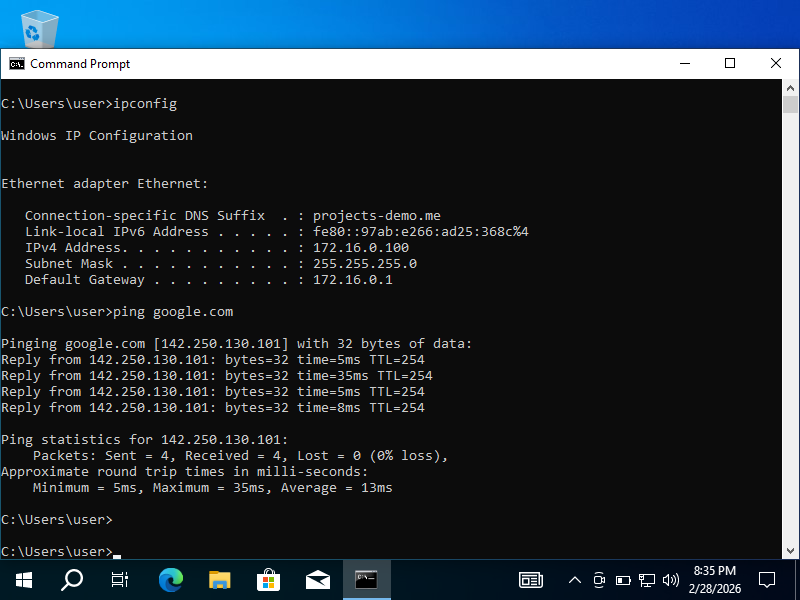
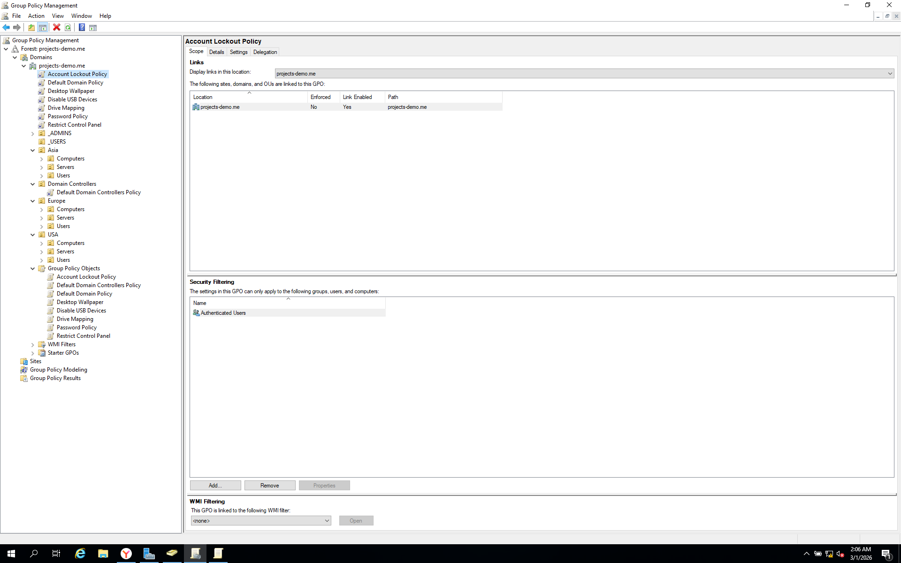
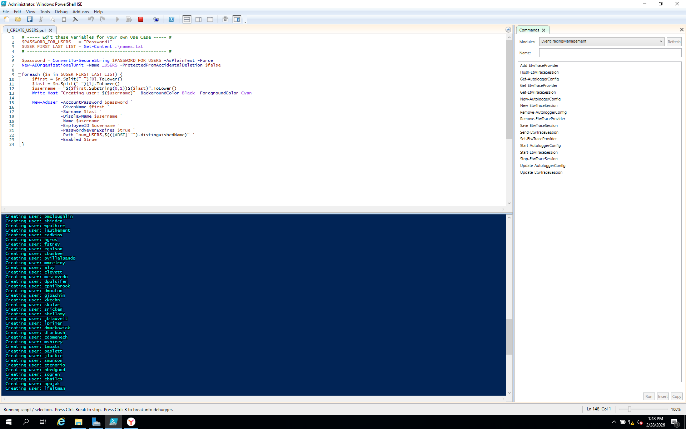
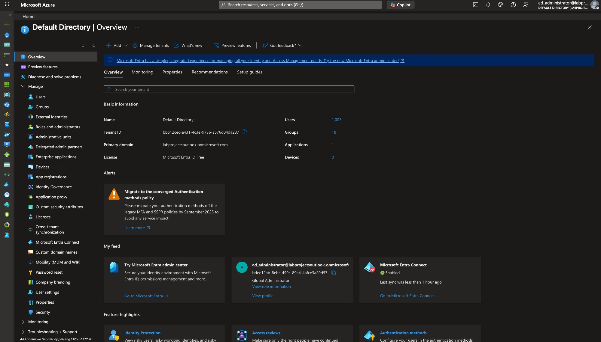
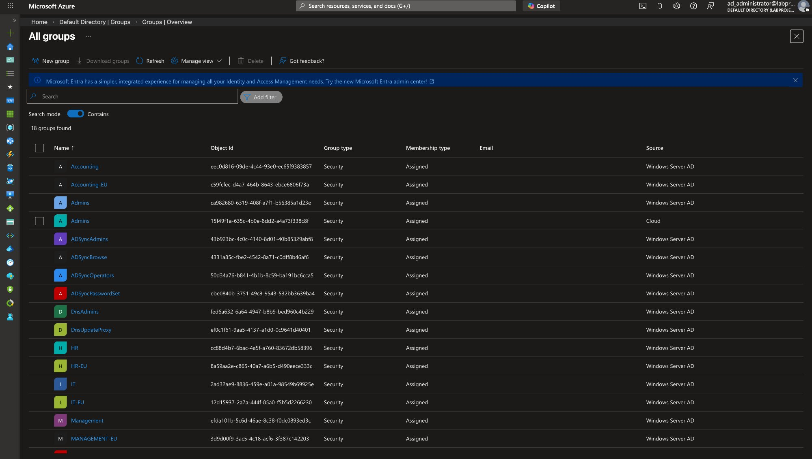
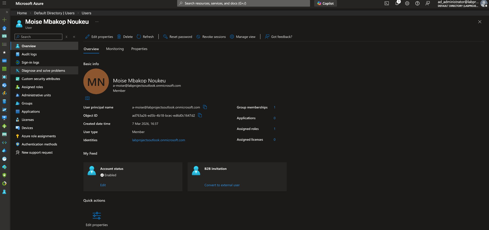

# 🏗️ Phase 1 — On-Premises Active Directory

> **Platform:** VirtualBox | Windows Server 2019 (DC) + Windows 10 clients
> **Domain:** `projects-demo.me` | **Network:** `172.16.0.0/24`

---

## Overview

Phase 1 establishes the on-premises foundation of the hybrid lab — a fully functional Windows Server 2019 Domain Controller running Active Directory Domain Services, DHCP, DNS, and NAT/RRAS. Three Windows 10 clients are domain-joined and managed through Group Policy. All subsequent phases in this project build on top of this infrastructure.

---

## What Was Built

### Domain Controller Setup

A Windows Server 2019 VM was promoted to a Domain Controller for the domain `projects-demo.me`. The AD DS role was installed via Server Manager alongside DNS, DHCP, and the Remote Access (RRAS) role to provide NAT-based internet access for internal clients. The DC hosts the `172.16.0.0/24` DHCP scope, serving IP addresses to all domain-joined machines.

### Organizational Unit Structure

The directory was structured to reflect a multinational organization with three geographic regions — **USA**, **Europe**, and **Asia**. Each region contains sub-OUs for `Computers`, `Users`, and `Servers`. Custom admin and user container OUs (`_ADMINS`, `_USERS`) were also created at the domain root for centralized account management. Security groups per department (IT, HR, Accounting, Sales, Management) were created within each regional OU.

### Bulk User Provisioning via PowerShell

Rather than manually creating accounts, a PowerShell script (`1_CREATE_USERS.ps1`) was written to bulk-provision users from a `names.txt` file. The script reads first/last name pairs, derives a `firstname.lastname` username format, creates the AD account with a standard password, and places each user in the `_USERS` OU. The script successfully provisioned **658 user accounts** in a single execution.

### Group Policy Objects (GPOs)

Seven GPOs were created and linked at the appropriate OU or domain level:

| GPO                    | Scope           | Purpose                            |
| ---------------------- | --------------- | ---------------------------------- |
| Password Policy        | Domain          | Min 8 chars, max 180-day age       |
| Account Lockout Policy | Domain          | 5 failed attempts → 10 min lockout |
| Disable USB Devices    | USA > Computers | Block all removable storage        |
| Desktop Wallpaper      | USA > Users     | Enforce corporate wallpaper        |
| Drive Mapping          | USA > Users     | Map network drives (D:, E:)        |
| Restrict Control Panel | USA > Users     | Block Control Panel & PC Settings  |
| Default Domain Policy  | Domain          | Baseline domain settings           |

### Client Domain Join & GPO Verification

Three Windows 10 clients (`CLIENT1`, `CLIENT2`, `COMPUTER1-EU`, `COMPUTER2-EU`) were joined to the `projects-demo.me` domain. After running `gpupdate /force`, GPOs were confirmed applied — a domain user (account `a-moise`) authenticated successfully with `whoami` returning `projects-demo\a-moise`, and attempts to access the Control Panel triggered the GPO restriction message: _"This operation has been cancelled due to restrictions in effect on this computer."_

---

## Key Screenshots

**Client receives DHCP lease from DC and has internet access via NAT/RRAS**

**CLIENT1 successfully joined to the projects-demo.me domain**

**OU structure in ADUC — USA, Europe, Asia with dept security groups**

**All 7 GPOs created and linked across the domain/OU hierarchy**

**GPO enforcement confirmed — Control Panel restriction blocking domain user**

**PowerShell bulk user creation script running — 658 accounts provisioned**

---

## Skills Demonstrated

- Active Directory Domain Services (AD DS) installation and DC promotion
- DHCP scope configuration and lease verification
- NAT / RRAS configuration for internal network internet access
- Organizational Unit design by geographic region and department
- PowerShell scripting for automated bulk user and group provisioning
- Group Policy creation, linking, scope filtering, and live enforcement verification
- Windows 10 domain join and user authentication testing

---

## Phase 2 — Azure Hybrid Identity ✅

> **Goal:** Extend the on-premises `projects-demo.me` domain into Azure by configuring Microsoft Entra Connect Sync, registering the custom domain, syncing all AD users and groups to Entra ID, and assigning Azure RBAC roles to cloud users.

### Environment

| Setting           | Value                                               |
| ----------------- | --------------------------------------------------- |
| **Tenant**        | `labprojectsoutlab.onmicrosoft.com`                 |
| **Custom Domain** | `projects-demo.me` (registered in Entra ID)         |
| **Sync Tool**     | Microsoft Entra Connect Sync                        |
| **Sync Scope**    | All users and groups from `projects-demo.me` forest |
| **License**       | Microsoft Entra ID Free                             |

---

### What Was Built

**1. Custom Domain Registration**
The on-premises domain `projects-demo.me` was registered in the Entra ID tenant. The domain shows as Unverified in a lab context (no public DNS control), but is correctly registered and used as the UPN suffix for all synced accounts.

**2. Microsoft Entra Connect Sync**
Entra Connect was installed on the Windows Server 2019 DC and configured to sync the entire `projects-demo.me` AD forest to Entra ID. The wizard completed successfully with `mS-DS-ConsistencyGuid` set as the source anchor attribute.

**Entra Connect Sync — Configuration complete on the DC (`projects-demo.me` forest)**

**3. Users and Groups Synced to Entra ID**
Following the initial sync, all 1,003 AD user accounts and 18 security groups appeared in Entra ID. Every user shows `On-premises synced = Yes` and the directory overview confirms Entra Connect status as **Enabled** with the last sync under 1 hour ago.

**Entra ID Directory Overview — 1,003 users, 18 groups, Entra Connect Enabled**

**All 18 security groups synced from Windows Server AD — source column confirms on-premises origin**

**4. Azure RBAC — Role Assignment**
A cloud user (`a-moise@labprojectsoutlook.onmicrosoft.com`) was created and assigned the **Global Reader** built-in role at the Organization scope, demonstrating least-privilege RBAC in the hybrid environment.

**Cloud user with Global Reader role assigned at Organization scope**

---

### Key Observations

- The sync brought across not just users but all AD security groups with full membership intact — the `Source` column on every group shows `Windows Server AD`
- Entra Connect uses `mS-DS-ConsistencyGuid` as the source anchor, which is the recommended approach for new installations as it avoids UPN-based anchor conflicts
- The free Entra ID tier supports Entra Connect Sync, password hash sync, and basic RBAC — sufficient to establish hybrid identity without a P2 license
- Conditional Access and PIM (Privileged Identity Management) require Entra ID P2 — not configured in this phase
