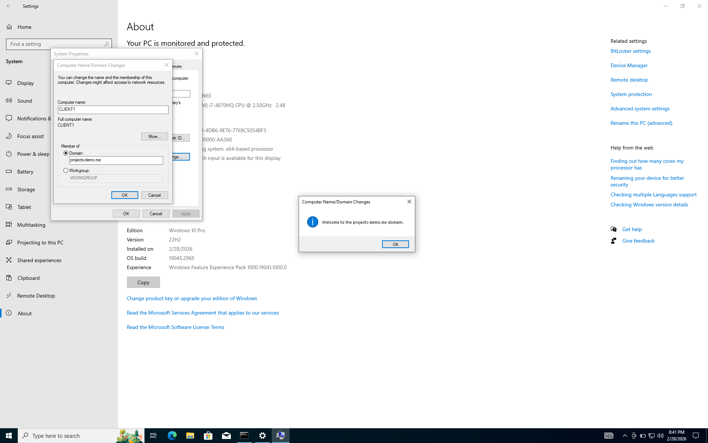
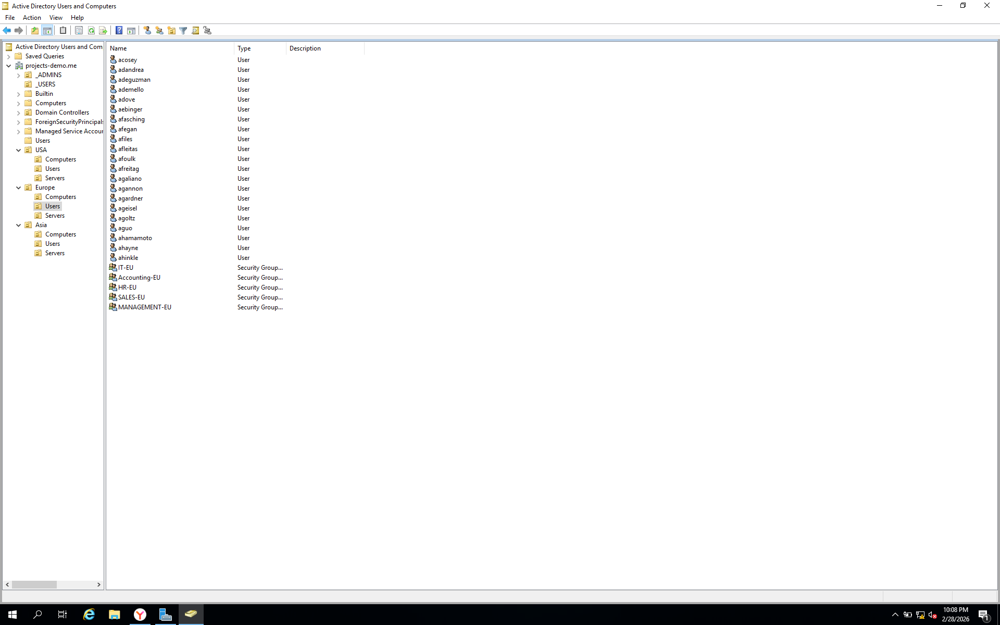

# 🏗️ Phase 1 — On-Premises Active Directory

> **Platform:** VirtualBox | Windows Server 2019 (DC) + Windows 10 clients
> **Domain:** `projects-demo.me` | **Network:** `172.16.0.0/24`

---

## Overview

Phase 1 establishes the on-premises foundation of the hybrid lab — a fully functional Windows Server 2019 Domain Controller running Active Directory Domain Services, DHCP, DNS, and NAT/RRAS. Three Windows 10 clients are domain-joined and managed through Group Policy. All subsequent phases in this project build on top of this infrastructure.

---

## What Was Built

### Domain Controller Setup

A Windows Server 2019 VM was promoted to a Domain Controller for the domain `projects-demo.me`. The AD DS role was installed via Server Manager alongside DNS, DHCP, and the Remote Access (RRAS) role to provide NAT-based internet access for internal clients. The DC hosts the `172.16.0.0/24` DHCP scope, serving IP addresses to all domain-joined machines.

### Organizational Unit Structure

The directory was structured to reflect a multinational organization with three geographic regions — **USA**, **Europe**, and **Asia**. Each region contains sub-OUs for `Computers`, `Users`, and `Servers`. Custom admin and user container OUs (`_ADMINS`, `_USERS`) were also created at the domain root for centralized account management. Security groups per department (IT, HR, Accounting, Sales, Management) were created within each regional OU.

### Bulk User Provisioning via PowerShell

Rather than manually creating accounts, a PowerShell script (`1_CREATE_USERS.ps1`) was written to bulk-provision users from a `names.txt` file. The script reads first/last name pairs, derives a `firstname.lastname` username format, creates the AD account with a standard password, and places each user in the `_USERS` OU. The script successfully provisioned **658 user accounts** in a single execution.

### Group Policy Objects (GPOs)

Seven GPOs were created and linked at the appropriate OU or domain level:

| GPO                    | Scope           | Purpose                            |
| ---------------------- | --------------- | ---------------------------------- |
| Password Policy        | Domain          | Min 8 chars, max 180-day age       |
| Account Lockout Policy | Domain          | 5 failed attempts → 10 min lockout |
| Disable USB Devices    | USA > Computers | Block all removable storage        |
| Desktop Wallpaper      | USA > Users     | Enforce corporate wallpaper        |
| Drive Mapping          | USA > Users     | Map network drives (D:, E:)        |
| Restrict Control Panel | USA > Users     | Block Control Panel & PC Settings  |
| Default Domain Policy  | Domain          | Baseline domain settings           |

### Client Domain Join & GPO Verification

Three Windows 10 clients (`CLIENT1`, `CLIENT2`, `COMPUTER1-EU`, `COMPUTER2-EU`) were joined to the `projects-demo.me` domain. After running `gpupdate /force`, GPOs were confirmed applied — a domain user (account `a-moise`) authenticated successfully with `whoami` returning `projects-demo\a-moise`, and attempts to access the Control Panel triggered the GPO restriction message: _"This operation has been cancelled due to restrictions in effect on this computer."_

---

## Key Screenshots

**Client receives DHCP lease from DC and has internet access via NAT/RRAS**

**CLIENT1 successfully joined to the projects-demo.me domain**

**OU structure in ADUC — USA, Europe, Asia with dept security groups**

**All 7 GPOs created and linked across the domain/OU hierarchy**

**GPO enforcement confirmed — Control Panel restriction blocking domain user**

**PowerShell bulk user creation script running — 658 accounts provisioned**

---

## Skills Demonstrated

- Active Directory Domain Services (AD DS) installation and DC promotion
- DHCP scope configuration and lease verification
- NAT / RRAS configuration for internal network internet access
- Organizational Unit design by geographic region and department
- PowerShell scripting for automated bulk user and group provisioning
- Group Policy creation, linking, scope filtering, and live enforcement verification
- Windows 10 domain join and user authentication testing
