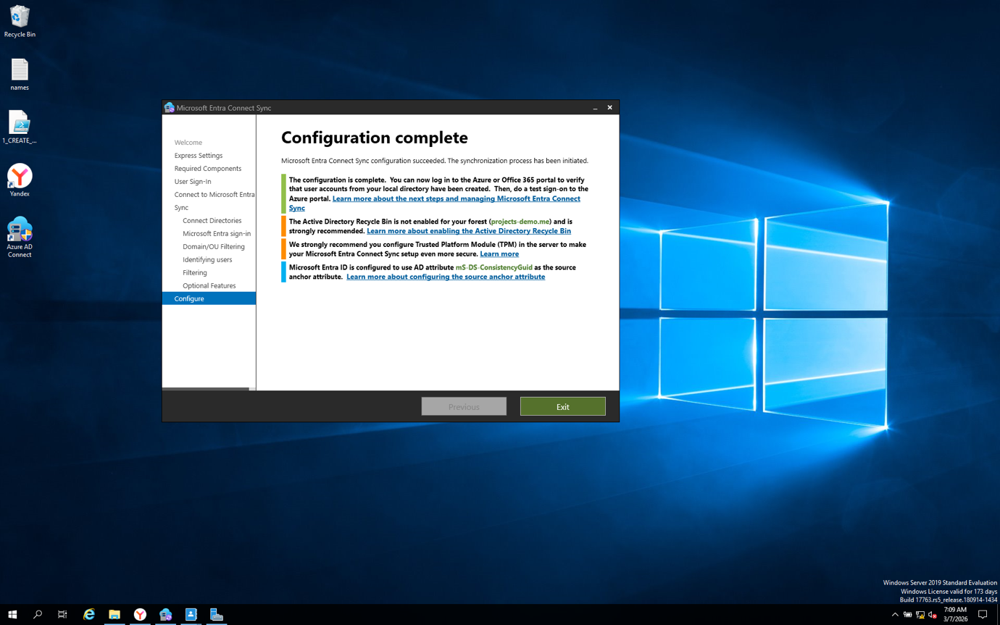
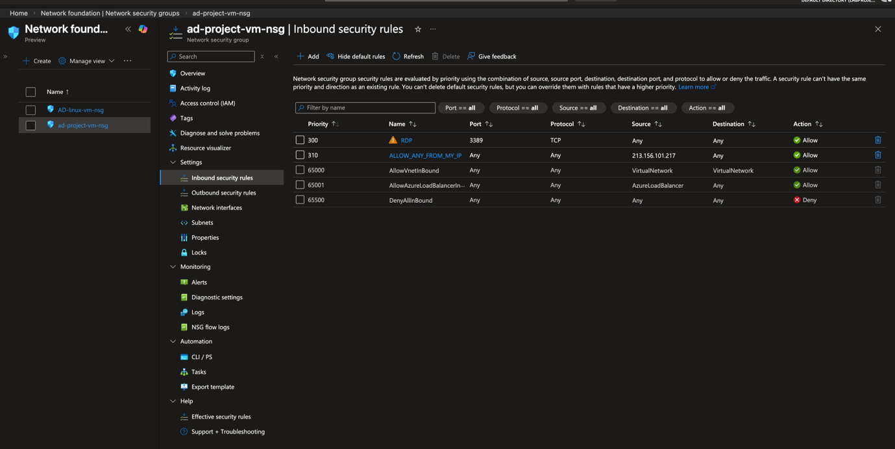
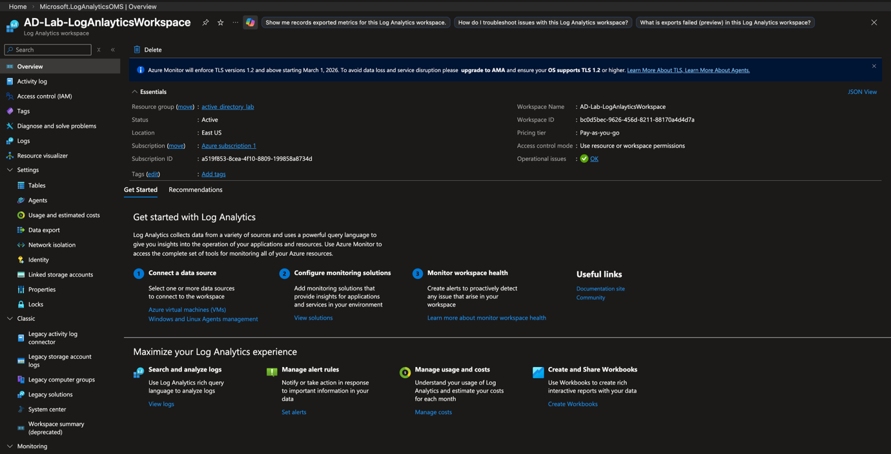
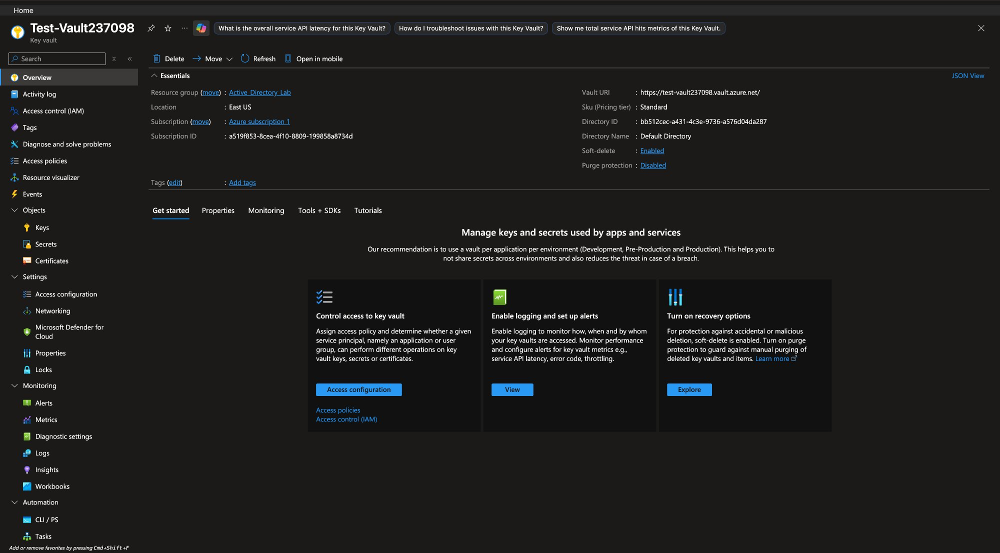
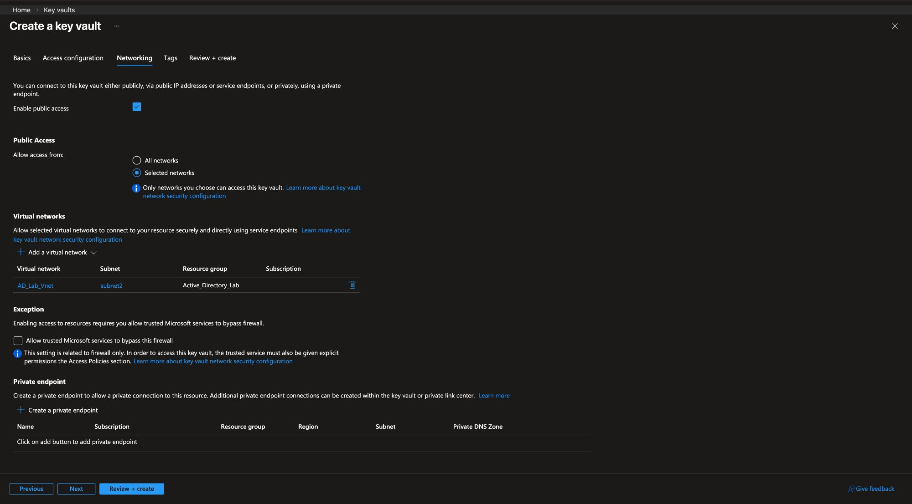
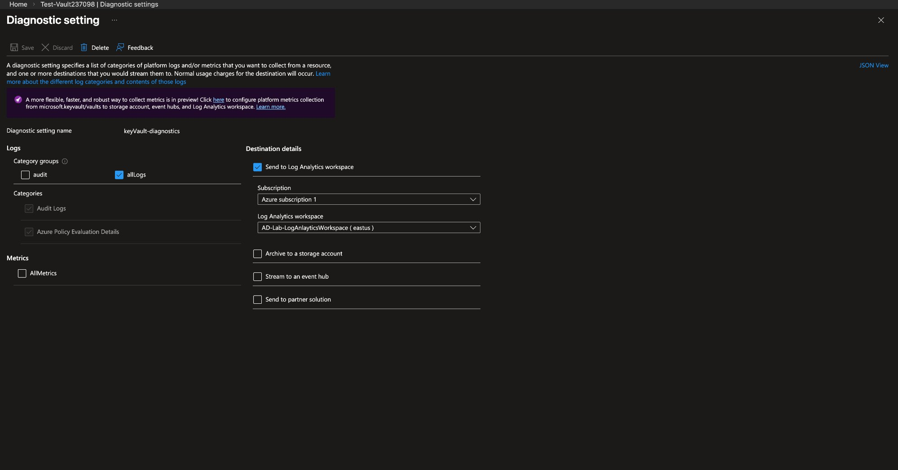
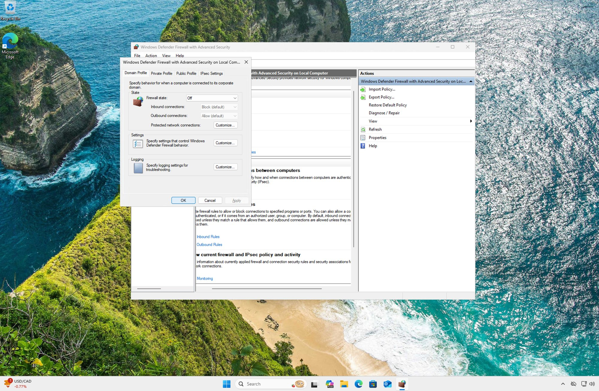
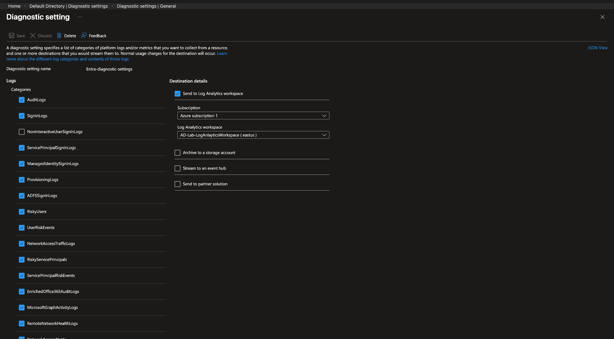
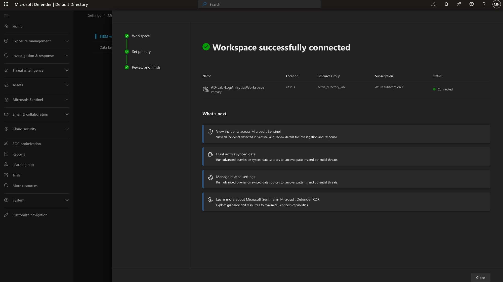
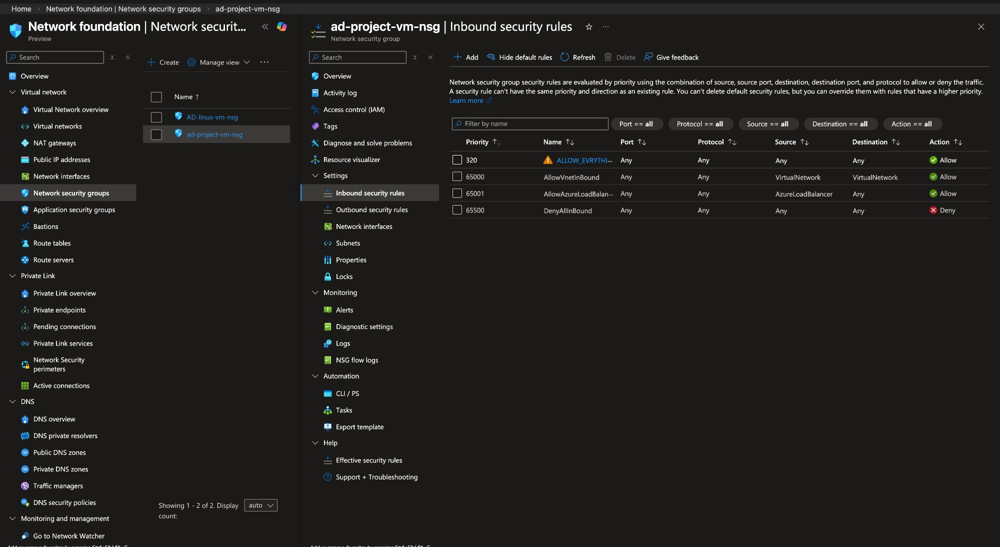

# 🏗️ Phase 1 — On-Premises Active Directory

> **Platform:** VirtualBox | Windows Server 2019 (DC) + Windows 10 clients
> **Domain:** `projects-demo.me` | **Network:** `172.16.0.0/24`

---

## Overview

Phase 1 establishes the on-premises foundation of the hybrid lab — a fully functional Windows Server 2019 Domain Controller running Active Directory Domain Services, DHCP, DNS, and NAT/RRAS. Three Windows 10 clients are domain-joined and managed through Group Policy. All subsequent phases in this project build on top of this infrastructure.

---

## What Was Built

### Domain Controller Setup

A Windows Server 2019 VM was promoted to a Domain Controller for the domain `projects-demo.me`. The AD DS role was installed via Server Manager alongside DNS, DHCP, and the Remote Access (RRAS) role to provide NAT-based internet access for internal clients. The DC hosts the `172.16.0.0/24` DHCP scope, serving IP addresses to all domain-joined machines.

### Organizational Unit Structure

The directory was structured to reflect a multinational organization with three geographic regions — **USA**, **Europe**, and **Asia**. Each region contains sub-OUs for `Computers`, `Users`, and `Servers`. Custom admin and user container OUs (`_ADMINS`, `_USERS`) were also created at the domain root for centralized account management. Security groups per department (IT, HR, Accounting, Sales, Management) were created within each regional OU.

### Bulk User Provisioning via PowerShell

Rather than manually creating accounts, a PowerShell script (`1_CREATE_USERS.ps1`) was written to bulk-provision users from a `names.txt` file. The script reads first/last name pairs, derives a `firstname.lastname` username format, creates the AD account with a standard password, and places each user in the `_USERS` OU. The script successfully provisioned **658 user accounts** in a single execution.

### Group Policy Objects (GPOs)

Seven GPOs were created and linked at the appropriate OU or domain level:

| GPO                    | Scope           | Purpose                            |
| ---------------------- | --------------- | ---------------------------------- |
| Password Policy        | Domain          | Min 8 chars, max 180-day age       |
| Account Lockout Policy | Domain          | 5 failed attempts → 10 min lockout |
| Disable USB Devices    | USA > Computers | Block all removable storage        |
| Desktop Wallpaper      | USA > Users     | Enforce corporate wallpaper        |
| Drive Mapping          | USA > Users     | Map network drives (D:, E:)        |
| Restrict Control Panel | USA > Users     | Block Control Panel & PC Settings  |
| Default Domain Policy  | Domain          | Baseline domain settings           |

### Client Domain Join & GPO Verification

Three Windows 10 clients (`CLIENT1`, `CLIENT2`, `COMPUTER1-EU`, `COMPUTER2-EU`) were joined to the `projects-demo.me` domain. After running `gpupdate /force`, GPOs were confirmed applied — a domain user (account `a-moise`) authenticated successfully with `whoami` returning `projects-demo\a-moise`, and attempts to access the Control Panel triggered the GPO restriction message: _"This operation has been cancelled due to restrictions in effect on this computer."_

---

## Key Screenshots

**Client receives DHCP lease from DC and has internet access via NAT/RRAS**

**CLIENT1 successfully joined to the projects-demo.me domain**

**OU structure in ADUC — USA, Europe, Asia with dept security groups**

**All 7 GPOs created and linked across the domain/OU hierarchy**

**GPO enforcement confirmed — Control Panel restriction blocking domain user**

**PowerShell bulk user creation script running — 658 accounts provisioned**

---

## Skills Demonstrated

- Active Directory Domain Services (AD DS) installation and DC promotion
- DHCP scope configuration and lease verification
- NAT / RRAS configuration for internal network internet access
- Organizational Unit design by geographic region and department
- PowerShell scripting for automated bulk user and group provisioning
- Group Policy creation, linking, scope filtering, and live enforcement verification
- Windows 10 domain join and user authentication testing

---

## Phase 2 — Azure Hybrid Identity ✅

> **Goal:** Extend the on-premises `projects-demo.me` domain into Azure by configuring Microsoft Entra Connect Sync, registering the custom domain, syncing all AD users and groups to Entra ID, and assigning Azure RBAC roles to cloud users.

### Environment

| Setting           | Value                                               |
| ----------------- | --------------------------------------------------- |
| **Tenant**        | `labprojectsoutlab.onmicrosoft.com`                 |
| **Custom Domain** | `projects-demo.me` (registered in Entra ID)         |
| **Sync Tool**     | Microsoft Entra Connect Sync                        |
| **Sync Scope**    | All users and groups from `projects-demo.me` forest |
| **License**       | Microsoft Entra ID Free                             |

---

### What Was Built

**1. Custom Domain Registration**
The on-premises domain `projects-demo.me` was registered in the Entra ID tenant. The domain shows as Unverified in a lab context (no public DNS control), but is correctly registered and used as the UPN suffix for all synced accounts.

**2. Microsoft Entra Connect Sync**
Entra Connect was installed on the Windows Server 2019 DC and configured to sync the entire `projects-demo.me` AD forest to Entra ID. The wizard completed successfully with `mS-DS-ConsistencyGuid` set as the source anchor attribute.

**Entra Connect Sync — Configuration complete on the DC (`projects-demo.me` forest)**

**3. Users and Groups Synced to Entra ID**
Following the initial sync, all 1,003 AD user accounts and 18 security groups appeared in Entra ID. Every user shows `On-premises synced = Yes` and the directory overview confirms Entra Connect status as **Enabled** with the last sync under 1 hour ago.

**Entra ID Directory Overview — 1,003 users, 18 groups, Entra Connect Enabled**

**All 18 security groups synced from Windows Server AD — source column confirms on-premises origin**

**4. Azure RBAC — Role Assignment**
A cloud user (`a-moise@labprojectsoutlook.onmicrosoft.com`) was created and assigned the **Global Reader** built-in role at the Organization scope, demonstrating least-privilege RBAC in the hybrid environment.

**Cloud user with Global Reader role assigned at Organization scope**

---

### Key Observations

- The sync brought across not just users but all AD security groups with full membership intact — the `Source` column on every group shows `Windows Server AD`
- Entra Connect uses `mS-DS-ConsistencyGuid` as the source anchor, which is the recommended approach for new installations as it avoids UPN-based anchor conflicts
- The free Entra ID tier supports Entra Connect Sync, password hash sync, and basic RBAC — sufficient to establish hybrid identity without a P2 license
- Conditional Access and PIM (Privileged Identity Management) require Entra ID P2 — not configured in this phase

---

## Phase 3 — Network Security ✅

> **Goal:** Deploy Network Security Groups (NSGs) on both VMs, restrict RDP and SSH access to trusted IPs only, enable VNet Flow Logs to capture all ingress/egress traffic, and route logs to the central Log Analytics workspace.

### Environment

| Setting              | Value                                                          |
| -------------------- | -------------------------------------------------------------- |
| **Resource Group**   | `Active_Directory_Lab`                                         |
| **VNet**             | `AD_Lab_Vnet`                                                  |
| **Subnets**          | `Subnet1`, `subnet2`                                           |
| **NSGs**             | `ad-project-vm-nsg` (Windows DC), `AD-linux-vm-nsg` (Linux VM) |
| **Flow Log Storage** | `labstorage23`                                                 |
| **Log Destination**  | `AD-Lab-LogAnlayticsWorkspace` (East US)                       |

---

### What Was Built

**1. NSG Rules — Windows DC (`ad-project-vm-nsg`)**

RDP access (port 3389) restricted to a single trusted public IP (`213.156.101.217`). All other inbound traffic is denied by the default `DenyAllInbound` rule at priority 65500. VNet-internal and Azure Load Balancer traffic are permitted via standard default rules.

| Priority | Rule                   | Port | Source            | Action   |
| -------- | ---------------------- | ---- | ----------------- | -------- |
| 300      | RDP                    | 3389 | `213.156.101.217` | ✅ Allow |
| 310      | ALLOW_ANY_FROM_MY_IP   | Any  | `213.156.101.217` | ✅ Allow |
| 65000    | AllowVnetInBound       | Any  | VirtualNetwork    | ✅ Allow |
| 65001    | AllowAzureLoadBalancer | Any  | AzureLoadBalancer | ✅ Allow |
| 65500    | DenyAllInbound         | Any  | Any               | ❌ Deny  |

**NSG inbound rules for the Windows DC — RDP locked to trusted IP only**

---

**2. VNet Flow Logs**

Flow logs configured at the VNet level targeting both `Subnet1` and `subnet2` in `Active_Directory_Lab`, stored in `labstorage23` (East US). This captures all accepted and denied traffic flows across the lab network for later KQL analysis.

---

**3. Log Analytics Workspace**

`AD-Lab-LogAnlayticsWorkspace` created in `active_directory_lab` resource group (East US, Pay-as-you-go). Status: **Active**, Operational issues: **OK**. This workspace serves as the central log sink for the entire lab — receiving NSG flow logs, Key Vault audit logs, and later Microsoft Sentinel data.

**Log Analytics Workspace — Active, operational, ready to receive data**

---

## Phase 4 — Key Vault & Secrets Management ✅

> **Goal:** Deploy Azure Key Vault in the lab resource group, restrict network access to the lab VNet only via a private endpoint, and route all audit logs to the central Log Analytics workspace.

### Environment

| Setting              | Value                                            |
| -------------------- | ------------------------------------------------ |
| **Vault Name**       | `Test-Vault237098`                               |
| **Resource Group**   | `Active_Directory_Lab`                           |
| **Location**         | East US                                          |
| **Pricing Tier**     | Standard                                         |
| **Soft-delete**      | Enabled                                          |
| **Network Access**   | Selected networks — `AD_Lab_Vnet / subnet2` only |
| **Private Endpoint** | `key-endpoint` → `subnet2`                       |
| **Diagnostic Logs**  | `allLogs` → `AD-Lab-LogAnlayticsWorkspace`       |

---

### What Was Built

**1. Key Vault Deployment**

`Test-Vault237098` deployed in the `Active_Directory_Lab` resource group. Soft-delete is enabled (protects against accidental deletion), purge protection is disabled (lab environment). The vault URI is `https://test-vault237098.vault.azure.net/`.

**Test-Vault237098 — live in Active_Directory_Lab, Standard tier, soft-delete enabled**

---

**2. Network Restriction — Selected Networks Only**

Public access restricted to **Selected networks** only. `AD_Lab_Vnet / subnet2` is the only whitelisted virtual network — no public internet access to the vault. This enforces that only resources within the lab VNet can reach Key Vault.

**Key Vault networking — access restricted to AD_Lab_Vnet/subnet2 only**

---

**3. Diagnostic Logs → Log Analytics**

Diagnostic setting `keyVault-diagnostics` configured to send `allLogs` (including Audit Logs and Azure Policy Evaluation Details) to `AD-Lab-LogAnlayticsWorkspace`. This means every secret access, key operation, and policy event is captured in the central workspace for KQL querying and Sentinel alerting in later phases.

**Key Vault diagnostic setting — allLogs routed to AD-Lab-LogAnlayticsWorkspace**

---

**4. VM Connectivity Verified**

End-to-end connectivity from the admin workstation to the Windows DC public IP (`213.156.101.217`) confirmed via ICMP ping — 17 packets transmitted, 17 received, **0% packet loss**. Round-trip avg: 74ms. This validates that NSG rules are correctly permitting traffic from the trusted source IP and the VM is reachable for RDP and log agent communication.

**Ping from admin workstation to VM public IP — 0% packet loss, connectivity confirmed**

---

**5. Windows Defender Firewall — Domain Profile Disabled**

Windows Defender Firewall Domain Profile disabled on the domain-joined VM to allow the Azure Monitor Agent (AMA) to communicate with the Log Analytics workspace without local firewall interference. In production this would be handled via a targeted inbound rule using the `AzureMonitor` service tag rather than disabling the profile entirely.

**Domain Profile firewall state Off — intentional for lab log agent communication**

---

### Key Observations

- Both phases share the same `AD-Lab-LogAnlayticsWorkspace` as the central log sink — NSG flow logs and Key Vault audit logs land in the same workspace, making cross-resource KQL queries possible in Phase 5
- Restricting Key Vault to Selected Networks + private endpoint is the recommended production pattern — public endpoint exposure is a common misconfiguration flagged by Defender for Cloud
- NSG `DenyAllInbound` as the lowest-priority baseline rule is security best practice — anything not explicitly allowed is blocked by default
- VNet-level flow logs (vs NSG-level) capture traffic at the subnet boundary, giving broader visibility across all resources in both subnets
- Disabling Windows Defender Firewall at the Domain Profile level is a lab shortcut — in production, AMA communication should be permitted via a targeted inbound rule using the `AzureMonitor` service tag

---

## Phase 5 — Monitoring & Log Collection ✅

> **Goal:** Connect all lab data sources to Microsoft Sentinel via the central Log Analytics workspace. Configure Entra ID diagnostic settings to stream identity and sign-in logs into the workspace, and connect Microsoft Defender XDR as the primary SIEM workspace.

### Environment

| Setting                         | Value                                           |
| ------------------------------- | ----------------------------------------------- |
| **SIEM**                        | Microsoft Sentinel (via Microsoft Defender XDR) |
| **Log Analytics Workspace**     | `AD-Lab-LogAnlayticsWorkspace` (East US)        |
| **Entra ID Diagnostic Setting** | `Entra-diagnostic-settings`                     |
| **Log Destination**             | `AD-Lab-LogAnlayticsWorkspace`                  |

---

### What Was Built

**1. Microsoft Sentinel Workspace Connected**

`AD-Lab-LogAnlayticsWorkspace` connected to Microsoft Defender XDR as the primary Sentinel workspace. Status shows **Connected** — all three setup steps (Workspace, Set primary, Review and finish) completed successfully. Sentinel is now the central SIEM for the lab, able to correlate signals across Entra ID, Key Vault, NSG flow logs, and endpoint telemetry.

**Sentinel workspace successfully connected — AD-Lab-LogAnlayticsWorkspace, status: Connected**

---

**2. Entra ID Diagnostic Settings — Full Log Pipeline**

Diagnostic setting `Entra-diagnostic-settings` configured on the Default Directory (Entra ID tenant) to stream the following log categories to `AD-Lab-LogAnlayticsWorkspace`:

| Log Category                 | Purpose                                                               |
| ---------------------------- | --------------------------------------------------------------------- |
| `AuditLogs`                  | Directory changes — user creation, group membership, role assignments |
| `SignInLogs`                 | Interactive user sign-ins                                             |
| `ServicePrincipalSignInLogs` | App and service principal authentication                              |
| `ManagedIdentitySignInLogs`  | Managed identity authentication events                                |
| `ProvisioningLogs`           | Entra Connect Sync provisioning activity                              |
| `RiskyUsers`                 | Users flagged as at-risk by Identity Protection                       |
| `UserRiskEvents`             | Individual risk detections per user                                   |
| `NetworkAccessTrafficLogs`   | Network access events                                                 |
| `RiskyServicePrincipals`     | At-risk service principals                                            |
| `ServicePrincipalRiskEvents` | Risk detections for service principals                                |
| `ADFSSignInLogs`             | ADFS federation sign-in events                                        |
| `MicrosoftGraphActivityLogs` | Microsoft Graph API call activity                                     |
| `EnrichedOffice365AuditLogs` | Office 365 audit events                                               |

All categories route to `AD-Lab-LogAnlayticsWorkspace (eastus)` under Azure subscription 1. This makes the full Entra ID identity plane visible in Sentinel for threat detection and KQL hunting.

**Entra ID diagnostic settings — 13+ log categories streaming to AD-Lab-LogAnlayticsWorkspace**

---

### Key Observations

- Connecting Entra ID sign-in and audit logs to the same workspace as NSG flow logs and Key Vault audit logs enables **cross-source correlation** — e.g. a suspicious sign-in followed by a Key Vault access attempt can be correlated in a single KQL query
- `RiskyUsers` and `UserRiskEvents` tables require Entra ID P2 in production for Identity Protection to populate them — in this lab they are configured but may remain empty without a P2 license
- `MicrosoftGraphActivityLogs` is valuable for detecting OAuth abuse and app consent grant attacks — a common cloud identity attack vector
- The Sentinel workspace connection via Microsoft Defender XDR (rather than the standalone Sentinel portal) reflects the unified SOC approach Microsoft recommends for environments using both MDE and Sentinel

---
