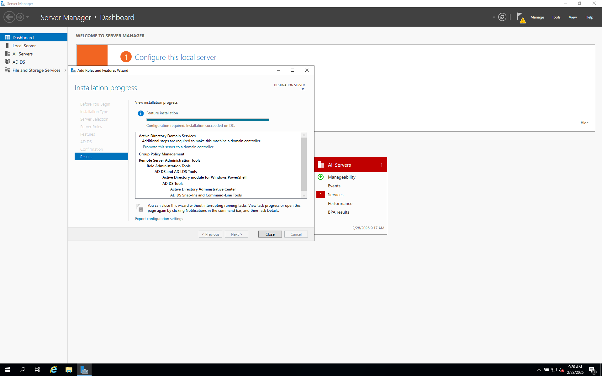
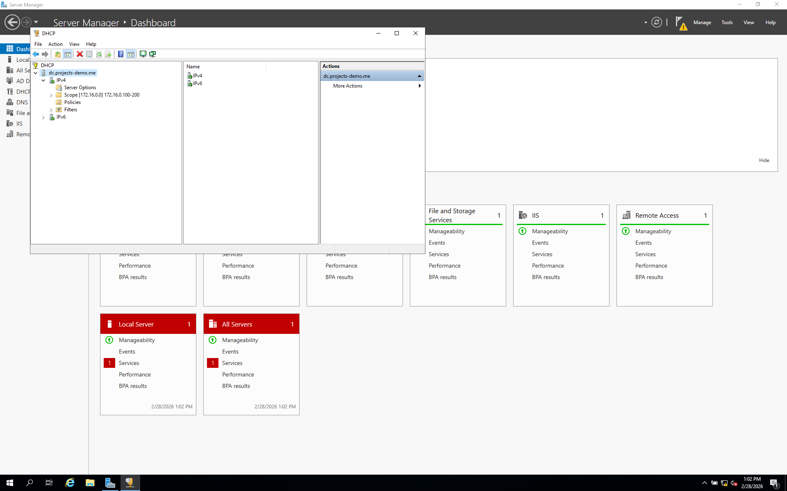
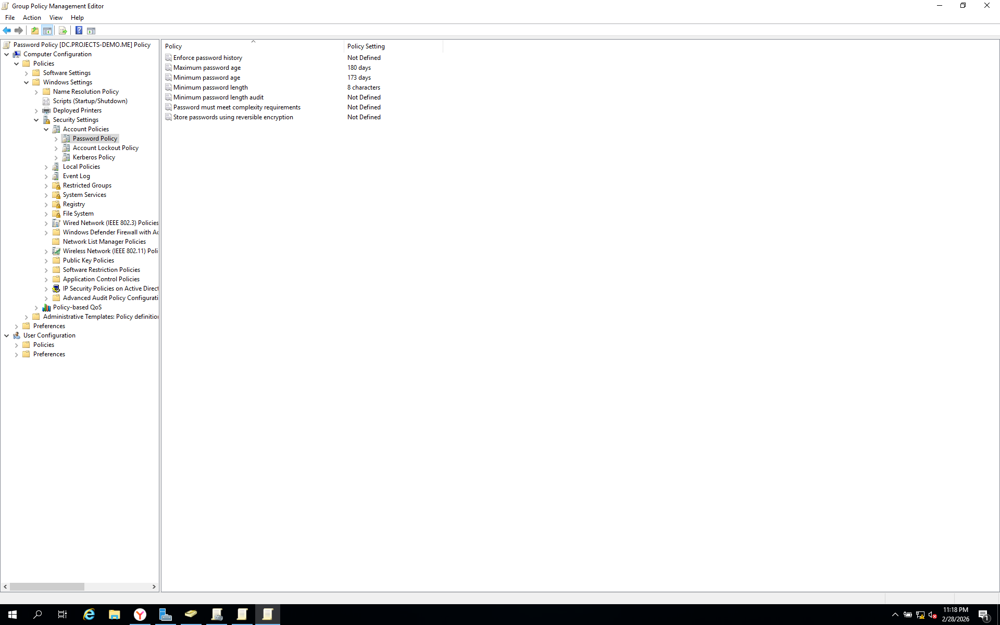
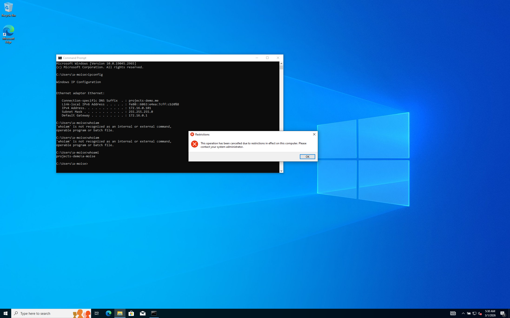
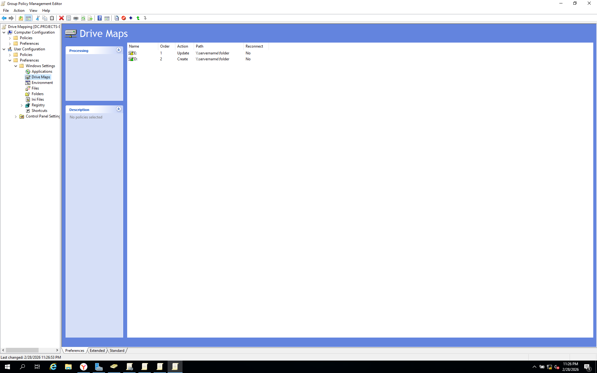

# Active Directory Home Lab (Windows Server 2019)

## Scenario:

"A mid-sized enterprise is migrating from a purely on-premises Active Directory environment to a hybrid Azure infrastructure. As the administrator, I was tasked with designing the on-premises AD environment, connecting it to Microsoft Entra ID, and layering a security monitoring solution using Microsoft Sentinel to detect and respond to identity-based threats across both environments."

## Lab Architecture

                Internet
                    │
               NAT / RRAS
                    │
       ┌─────────────────────────┐
       │ Domain Controller (DC)  │
       │ Windows Server 2019     │
       │                         │
       │ - Active Directory DS   │
       │ - DNS                   │
       │ - DHCP                  │
       │ - Group Policy          │
       └───────────┬─────────────┘
                   │
          Internal Virtual Network
                   │
      ┌───────────────┬───────────────┬───────────────┐
      │   CLIENT1     │   CLIENT2     │   CLIENT3     │
      │  Windows 10   │  Windows 10   │  Windows 10   │
      └───────────────┴───────────────┴───────────────┘

## Overview

This project demonstrates the deployment of a Windows Active Directory lab environment using Windows Server 2019 as a Domain Controller and Windows 10 client machines joined to the domain.

The goal of this lab is to simulate a small enterprise network where a Domain Controller centrally manages users, computers, network services, and security policies


## Technologies Used

- Windows Server 2019
- Windows 10 Pro
- Active Directory Domain Services (AD DS)
- DHCP Server
- Routing and Remote Access (RRAS)
- Group Policy Management
- PowerShell
- VirtualBox

## Domain Controller Setup

The server was configured as a Domain Controller by installing Active Directory Domain Services.

### AD DS Installation



### DHCP Configuration

The Domain Controller was configured to act as a DHCP server that assigns IP addresses automatically to domain clients.

### DHCP Scope

    Network: 172.16.0.0/24
    Gateway: 172.16.0.1
    IP Range: 172.16.0.100 – 172.16.0.200

### DHCP Scope



## Active Directory Organizational Structure

To simulate an enterprise structure, Organizational Units (OUs) were created by geographic region.


### PowerShell User Automation

A PowerShell script was used to automatically create multiple users in Active Directory.

```powershell
$PASSWORD_FOR_USERS   = "Password1"
$USER_FIRST_LAST_LIST = Get-Content .\names.txt
# ------------------------------------------------------ #

$password = ConvertTo-SecureString $PASSWORD_FOR_USERS -AsPlainText -Force
New-ADOrganizationalUnit -Name _USERS -ProtectedFromAccidentalDeletion $false

foreach ($n in $USER_FIRST_LAST_LIST) {
    $first = $n.Split(" ")[0].ToLower()
    $last = $n.Split(" ")[1].ToLower()
    $username = "$($first.Substring(0,1))$($last)".ToLower()
    Write-Host "Creating user: $($username)" -BackgroundColor Black -ForegroundColor Cyan

    New-AdUser -AccountPassword $password `
               -GivenName $first `
               -Surname $last `
               -DisplayName $username `
               -Name $username `
               -EmployeeID $username `
               -PasswordNeverExpires $true `
               -Path "ou=_USERS,$(([ADSI]``"").distinguishedName)" `
               -Enabled $true
}
```


## Domain Join and CLIENT Network Verification

Client machines were successfully joined to the domain.


The client received an IP address from the DHCP server.

Command used:

```cmd
ipconfig
```

## CLIENT VERIFICATION


## Group Policy Configuration

The following security controls were implemented:

- Password policy enforcement
- Account lockout policy
- USB storage restriction
- Control Panel access restriction
- Drive Mapping
- Desktop Wallpaper


Password complexity requirements were enforced across the domain.

## Password Policy Settings



## Control Panel access restriction Confirmation



## Drive Mapping Configuration



## Future Improvements

Potential improvements for this lab include:

- File server with NTFS permissions
- Security group role-based access control (RBAC)
- Windows Event Forwarding
